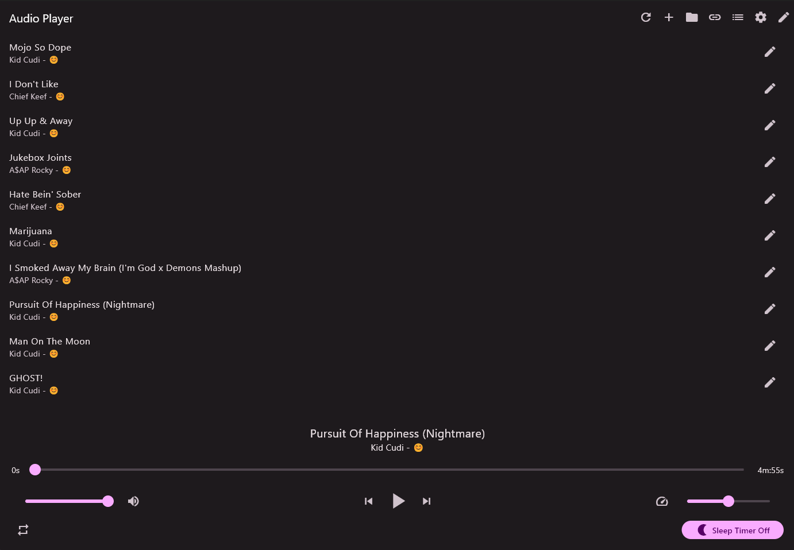
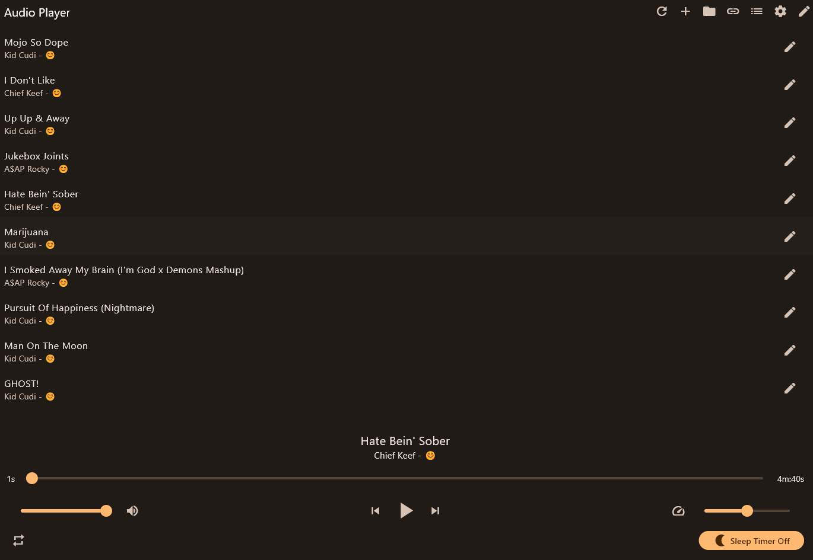

# AudioPlayer

Flutter audio player with YouTube download support. 

## Features
* Play audio files from local storage
* Download audio from YouTube
* Material 3
* Clean Interface
* Dark Mode
* Cross Platform (macOS, Windows, Linux) 
* Sleep Timer
* Speed Control

## Getting Started
1. Clone the repo
2. Run `flutter pub get`
3. Run `flutter run`
4. Enjoy!

## Build
1. Run `flutter pub get`
2. Run `flutter build` (macOS and Windows only)

## Dependencies
* window_manager
* provider
* file_picker
* sqflite
* path
* shared_preferences
* media_kit
* media_kit_libs_audio
* flutter_material_color_picker
* youtube_explode_dart
* sqflite_common_ffi

## To Do
* [ ] Add support for more audio formats
* [ ] Add working shuffle feature
* [ ] Metadata support
* [ ] File Sorting (Artist, Album, etc.)

## Bugs
* [ ] Theme doesn't save across restarts

## Screenshots

